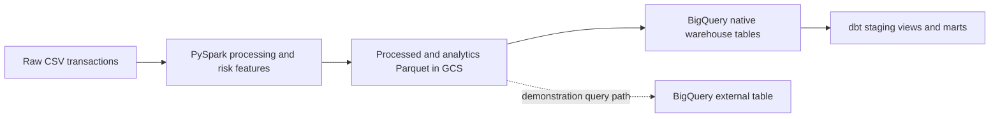

# Financial Risk Data Platform

This repository implements a batch-oriented financial risk data platform on Google Cloud Platform using Terraform, Google Cloud Storage, PySpark, BigQuery, dbt, and Airflow.

## Architecture



The production dbt models read the five native BigQuery warehouse tables loaded by `warehouse/load_bigquery_tables.py`. The Terraform-managed `daily_transaction_summary_external` table is intentionally retained as an architectural demonstration of querying analytics Parquet directly in GCS without loading it into native BigQuery storage; dbt does not use that external table.

## Repository Structure

- `batch-processing/`: PySpark ETL, feature generation, and validation
- `cloud/`: safe mirror synchronization to narrow GCS prefixes
- `warehouse/`: BigQuery native-table loading and validation
- `pipeline/`: fail-fast end-to-end cloud pipeline runner
- `dbt/risk_analytics/`: dbt staging models, marts, and data tests
- `airflow/dags/`: daily Airflow orchestration
- `infrastructure/terraform/`: GCP infrastructure configuration

## End-to-End Pipeline

`pipeline/run_cloud_pipeline.py` runs these seven stages in order and stops immediately if any stage fails:

1. Run the local batch pipeline, including raw/processed/feature validation
2. Mirror processed data to GCS
3. Mirror analytics data to GCS
4. Load native BigQuery warehouse tables
5. Validate native BigQuery warehouse tables
6. Run all dbt models
7. Run all dbt tests

```bash
.venv/bin/python pipeline/run_cloud_pipeline.py
```

By default, dbt is resolved at `.venv-dbt2/bin/dbt`. To use another compatible executable:

```bash
DBT_EXECUTABLE=/path/to/dbt .venv/bin/python pipeline/run_cloud_pipeline.py
```

## Reproducible dbt Setup

The main PySpark environment uses Python 3.14, while the verified dbt environment uses Python 3.11. Create dbt's environment separately; virtual environments are ignored and must not be committed.

```bash
python3.11 -m venv .venv-dbt2
.venv-dbt2/bin/python -m pip install --upgrade pip
.venv-dbt2/bin/python -m pip install -r requirements-dbt.txt

.venv-dbt2/bin/dbt debug --project-dir dbt/risk_analytics --profiles-dir dbt/risk_analytics
.venv-dbt2/bin/dbt run --project-dir dbt/risk_analytics --profiles-dir dbt/risk_analytics
.venv-dbt2/bin/dbt test --project-dir dbt/risk_analytics --profiles-dir dbt/risk_analytics
```

The repository profile uses OAuth and contains no credential or private-key path. It supports these optional environment variables:

- `GCP_PROJECT_ID` (default `risk-data-platform-npg-2026`)
- `GCP_LOCATION` (default `us-central1`)
- `DBT_DATASET` (default `risk_analytics`)

Google Application Default Credentials or an authenticated gcloud session must already be available.

## Airflow DAG

The daily `risk_pipeline_dag` has one linear, fail-fast task chain. Each task calls an existing project script or dbt command rather than duplicating transformation logic:

```text
run_local_batch_pipeline
  -> sync_processed_to_gcs
  -> sync_analytics_to_gcs
  -> load_bigquery_tables
  -> validate_bigquery_tables
  -> dbt_run
  -> dbt_test
```

Airflow uses `.venv-dbt2/bin/dbt` by default and also honors `DBT_EXECUTABLE`.

## Warehouse Validation

```bash
.venv/bin/python warehouse/validate_bigquery_tables.py
```

The validator checks row counts, table grains, null/range contracts, transaction reconciliation, high-risk classification logic, and high-risk partition metadata.

## Verified Spark Benchmark Results

The tracked evidence is in `benchmarks/results/batch_100k_strategy_comparison.csv` and `benchmarks/results/batch_write_file_count_investigation.md`.

- Input rows: 100350
- Output rows: 100350
- Distinct event dates: 31
- Baseline median runtime: 7.95s
- Repartitioned median runtime: 7.51s
- Runtime improvement: 5.5%
- Baseline Parquet files: 248
- Repartitioned Parquet files: 31
- File reduction: 87.5%
- Baseline size: 7.86MB
- Repartitioned size: 5.99MB
- Size reduction: 23.8%

## Future Production Hardening

Atomic warehouse generation swapping and checksum-based GCS content verification are intentionally outside project v1. Current synchronization validates exact relative Parquet inventories and rejects incomplete or empty local sources before enabling deletion.
