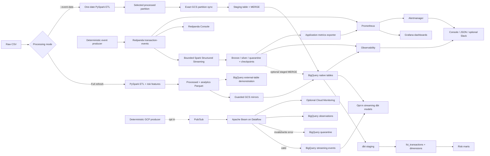

# Financial Risk Data Platform — Version 1.4

A GCP data engineering portfolio project with a verified batch warehouse and incremental pipeline, a local Kafka-compatible streaming mode, and an opt-in cost-controlled GCP Pub/Sub/Dataflow streaming deployment definition. It is not presented as production infrastructure or professional production experience.

## Architecture



The dimensional core contains `fct_transactions` at one row per `transaction_id`, `dim_customer` at one row per `customer_id`, `dim_merchant` at one row per `merchant_id`, and `dim_date` at one row per observed `event_date`. Stable source natural keys are used; v1.1 intentionally models current state rather than SCD Type 2 history.

## Run the pipelines

Prerequisites are authenticated Google Application Default Credentials, provisioned infrastructure, `.venv` for the Python/Spark requirements, and `.venv-dbt2` for `requirements-dbt.txt`. Terraform execution is separate from pipeline execution.

Full cloud pipeline—local batch validation, narrow GCS mirrors, native BigQuery loads and validation, then dbt run/test:

```bash
.venv/bin/python pipeline/run_cloud_pipeline.py
```

One-date incremental pipeline—dynamic partition overwrite, exact partition sync, BigQuery staging-and-`MERGE`, then dbt run/test:

```bash
.venv/bin/python pipeline/run_incremental_pipeline.py --event-date 2026-07-08
```

The same event date can be rerun safely. The warehouse `MERGE` matches on `transaction_id`, updates matched rows, and inserts new rows.

Version 1.3 local streaming and monitoring demo:

```bash
make setup
make docker-up
make stream-produce
make stream-process
make stream-validate
make stream-restart-snapshot
make stream-process
make stream-restart-verify
make observe
make alert-demo
make docker-down
```

The three local topics are `transaction-events`, `transaction-events-dlq`, and `streaming-risk-alerts`, each with one partition for deterministic local behavior. The streaming producer/consumer is deliberately separate from canonical batch data. BigQuery loading is an explicit host-side operation, and streaming dbt models are disabled by default so the existing 15-model/37-test graph remains unchanged. With a compatible populated source, local streaming enables 19 models/57 tests and GCP streaming enables 19 models/58 tests.

Version 1.4 GCP mode is disabled by default. Safe local checks create no GCP resources:

```bash
make gcp-streaming-producer-dry-run
make gcp-streaming-dbt-parse
terraform -chdir=infrastructure/terraform plan
```

An approved live demo requires explicit cost acknowledgement, performs a project/billing/worker preflight, uses 1,000 events and one worker by default, and must be stopped within 15 minutes:

```bash
export ACKNOWLEDGE_GCP_COST_RISK=true
make gcp-streaming-preflight
make gcp-streaming-plan   # plan only; never applies
make gcp-streaming-demo   # billable; only after approved provisioning
make gcp-streaming-stop
make gcp-streaming-check-active
```

The approximately $30–$50-or-less usage target is a design goal, not a guarantee or hard cap. Actual cost depends on runtime, region, pricing, and existing project activity. Read [GCP cost controls and cleanup](docs/29-gcp-cost-controls-and-cleanup.md) before using live GCP.

Useful verification commands:

```bash
.venv/bin/python warehouse/validate_bigquery_tables.py
.venv-dbt2/bin/dbt debug --project-dir dbt/risk_analytics --profiles-dir dbt/risk_analytics
.venv-dbt2/bin/dbt run --project-dir dbt/risk_analytics --profiles-dir dbt/risk_analytics
.venv-dbt2/bin/dbt test --project-dir dbt/risk_analytics --profiles-dir dbt/risk_analytics
.venv/bin/python benchmarks/run_scale_tests.py --sizes 1000000 5000000 10000000
```

`DBT_EXECUTABLE` can point the pipeline runners and Airflow DAG to another compatible dbt executable. The committed dbt profile uses OAuth and environment-variable configuration; it contains no key file or credential.

## Verified evidence

Canonical validation reconciles 100,350 processed rows and unique transaction IDs across 31 event dates (2026-06-08 through 2026-07-08), including 3,261 fraud rows. Five feature tables and the native `processed_transactions` table feed the dbt layers.

The tracked 100,350-row Spark strategy comparison reduced Parquet output from 248 to 31 files (87.5%), reduced output size from 7.86 MB to 5.99 MB (23.8%), and changed median local runtime from 7.95 to 7.51 seconds (5.5%). See [`benchmarks/results/batch_100k_strategy_comparison.csv`](benchmarks/results/batch_100k_strategy_comparison.csv).

Separate deterministic **local synthetic scale tests** completed and reconciled:

| Rows | Dates | Runtime | Rows/s | Parquet files | Output bytes |
|---:|---:|---:|---:|---:|---:|
| 1,000,000 | 31 | 14.7662s | 67,722.09 | 31 | 52,784,849 |
| 5,000,000 | 31 | 29.4523s | 169,766.16 | 31 | 243,147,767 |
| 10,000,000 | 31 | 45.4968s | 219,795.88 | 31 | 470,591,204 |

These are local `Spark local[*]` results on the recorded 8-CPU environment, not production or distributed-cluster claims. Evidence is in [`scale_test_results.csv`](benchmarks/results/scale_test_results.csv) and [`scale_test_report.md`](benchmarks/results/scale_test_report.md). The isolated late-data test evidence is in [`incremental_merge_evidence.csv`](benchmarks/results/incremental_merge_evidence.csv).

## Documentation

Start with the [documentation index](docs/README.md) or the guided [learning path](docs/LEARNING_PATH.md). The deep documentation covers architecture, contracts, every major file and function, Spark internals, GCS safety, BigQuery, dimensional modeling, incremental MERGE behavior, dbt, Airflow, scale tests, failure scenarios, production trade-offs, interview preparation, and claim-safe [resume evidence](docs/resume/verified-project-bullets.md).

Version 1.2 operations begin with [Docker/local development](docs/22-docker-and-local-development.md), [streaming](docs/23-streaming-pipeline.md), [observability and alerting](docs/24-data-observability-and-alerting.md), [CI/CD](docs/25-ci-cd.md), [deployment modes](docs/26-deployment-guide.md), and the [runbook](docs/27-v1-2-operations-runbook.md).

Version 1.3 adds the [streaming runtime and monitoring guide](docs/28-v1-3-streaming-runtime-and-monitoring.md) and [demo troubleshooting runbook](docs/29-v1-3-demo-runbook.md).

Version 1.4 adds [GCP streaming deployment](docs/28-gcp-streaming-deployment.md), [cost controls and cleanup](docs/29-gcp-cost-controls-and-cleanup.md), and the [GCP streaming runbook](docs/30-gcp-streaming-runbook.md).

## Known limitations

- This is a local-development portfolio system, not a production SLA or distributed-cluster benchmark.
- Full GCS synchronization is mirror-style rather than an atomic generation swap; its delete-enabled operation is restricted by exact bucket/prefix guards and inventory checks.
- Inventory validation compares object paths and counts, not content checksums.
- The incremental transaction fact uses a processed timestamp watermark; a full refresh remains available for historical rebuilds.
- Dimensions are current-state natural-key models, not SCD Type 2 history.
- Airflow DAG syntax and task wiring are repository-validated, but an Airflow scheduler runtime is not bundled with the project.
- Streaming is a bounded single-broker/local-Spark simulation; no throughput, SLA, or production real-time claim is made.
- The optional streaming BigQuery loader and streaming dbt models require an explicitly populated cloud source and are not part of default v1.1 execution.
- Console/JSON observations and optional Slack are lightweight portfolio alerting, not a production paging system.
- Prometheus, Grafana, Alertmanager, and Redpanda Console are single-host demo services without HA, retention, authentication hardening, or production SLAs.
- The isolated late-arrival demonstration creates dedicated cloud test resources; this work does not delete cloud datasets or buckets.
- GCP Pub/Sub/Dataflow resources are opt-in definitions and were not created or live-verified as part of the credential-free v1.4 implementation.
- Pub/Sub/Dataflow streaming is unbounded; the short-demo launcher and runtime alert reduce risk but do not replace manual active-job and Billing checks.
- Cloud Billing budgets alert on reported spend; they do not impose a hard spending cap.
