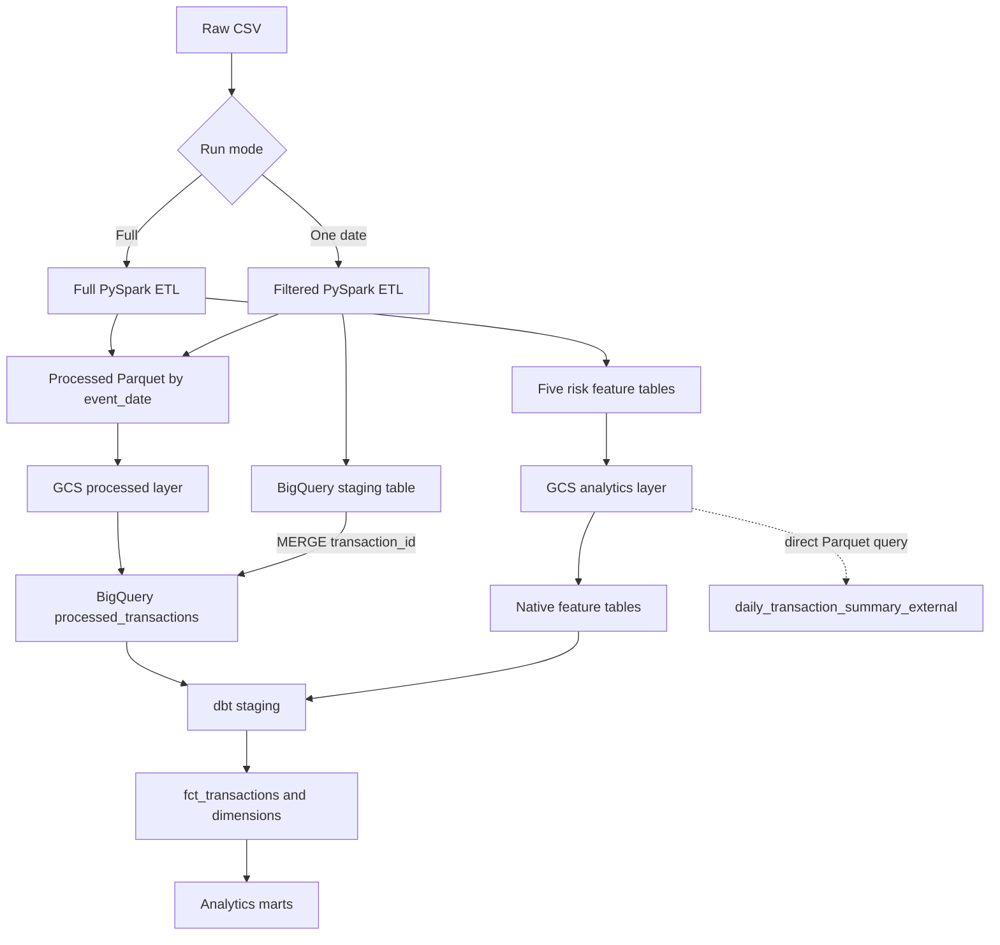
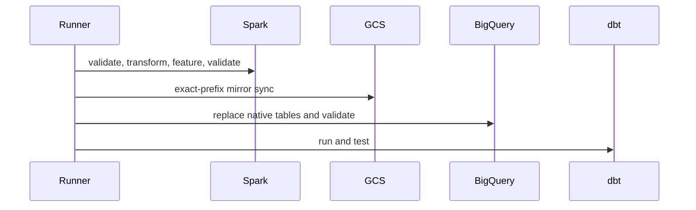

# End-to-End Architecture

The design separates storage concerns. Local and GCS Parquet are lake-style physical layers. BigQuery native tables are the warehouse source for dbt. The external table remains a demonstration of query-in-place behavior and is not a dbt production source.

Full batch sequence:

All subprocess stages use nonzero exit status for linear failure propagation.
