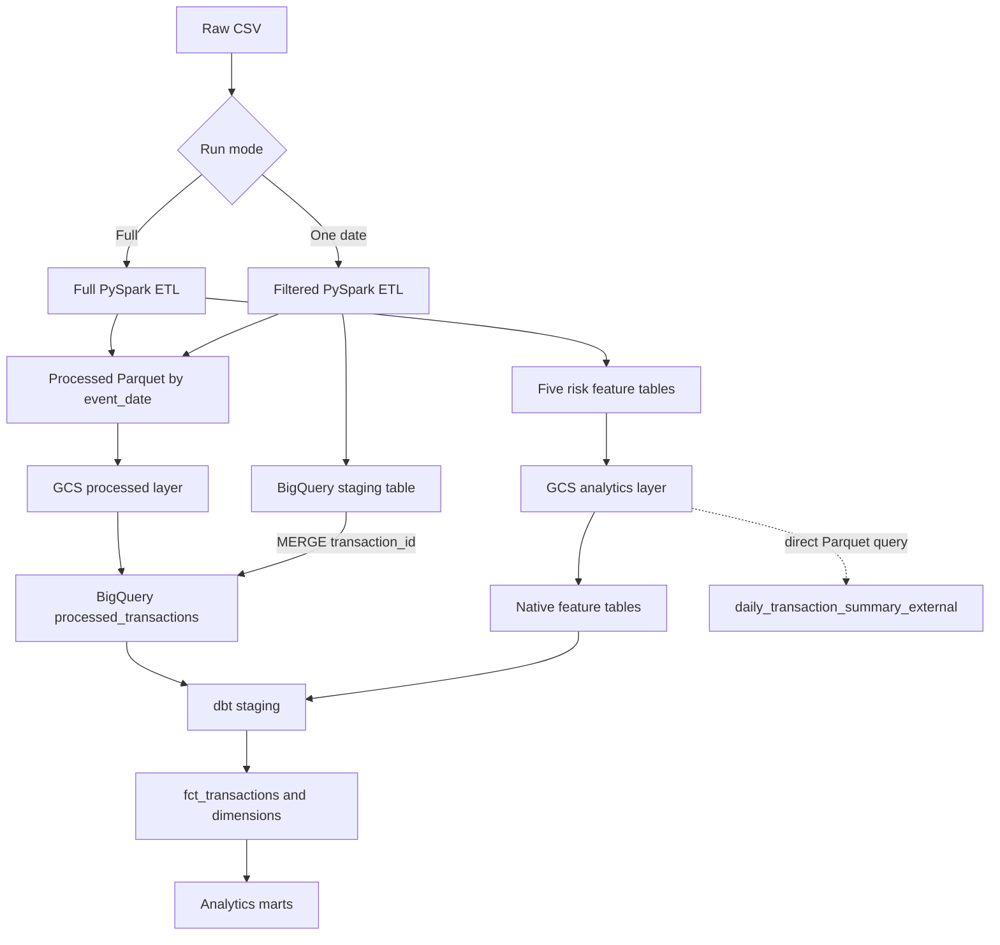
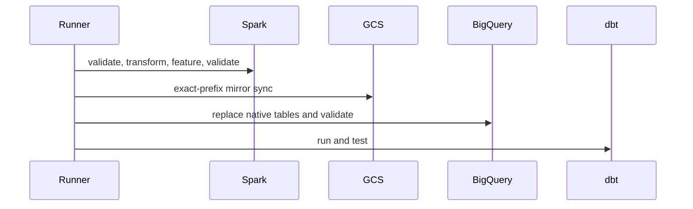
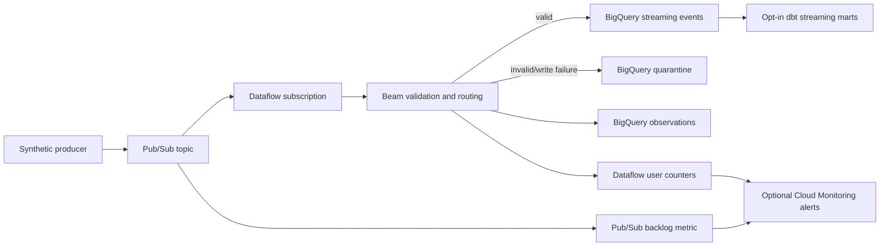

# End-to-End Architecture

Version 1.2 adds a deliberately separate simulation path: deterministic events flow through Redpanda and bounded Spark Structured Streaming into local bronze/silver/quarantine artifacts, with an optional host-side BigQuery `MERGE` and opt-in dbt models. Lightweight observations feed console/file/optional Slack alerts. This extension does not change the canonical v1.1 batch path or its evidence; see [the streaming design](23-streaming-pipeline.md).

The design separates storage concerns. Local and GCS Parquet are lake-style physical layers. BigQuery native tables are the warehouse source for dbt. The external table remains a demonstration of query-in-place behavior and is not a dbt production source.

Full batch sequence:

All subprocess stages use nonzero exit status for linear failure propagation.

## Version 1.4 opt-in GCP streaming branch

The existing batch and local Redpanda/Spark paths remain intact. Version 1.4 adds a separately enabled deployment definition:

Terraform defaults every v1.4 creation flag to false. The short demo uses one worker and 1,000 events, requires cost acknowledgement, and cancels only jobs named `financial-risk-v14-demo-*`. This branch is implemented and locally parsed/tested but is not represented as a live-verified or production deployment.
