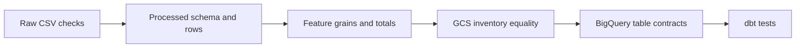

# Validation and Reconciliation

Validation occurs at several boundaries:

Raw checks enforce column shape, parsable values, uniqueness, and positive amounts. Processed validation compares the exact schema, row/ID counts, dates, physical directories, nulls, and ranges. Incremental mode scopes file counting and date checks to the requested partition.

Feature validation checks grains, fraud-rate arithmetic, count ranges, activity windows, high-risk classification, and 100,350-row reconciliation. GCS checks compare relative Parquet object names. BigQuery repeats warehouse contracts and partition metadata checks. dbt provides model-level not-null, unique, relationship, range, and reconciliation tests.

Failure is explicit: validators return false or raise; runners use `check=True`; later stages do not run. A passing downstream count never substitutes for a failed upstream contract.
