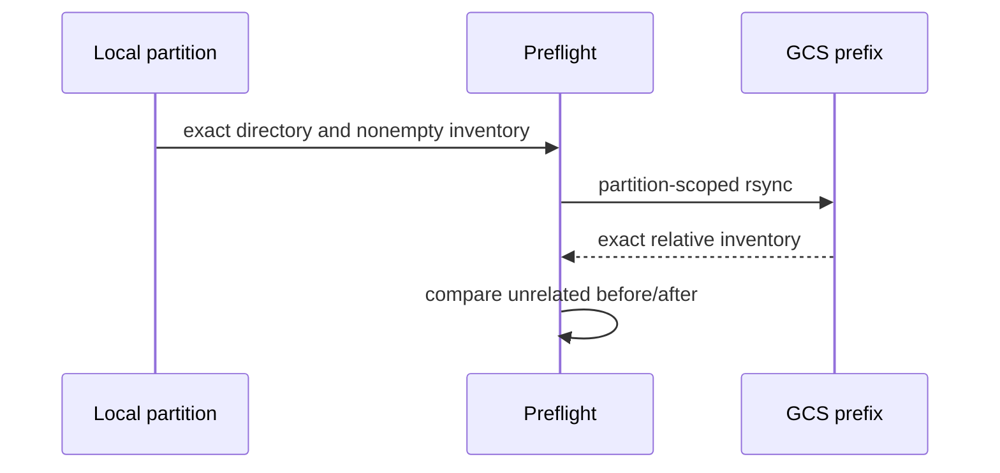

# GCS Sync and Idempotency

Full synchronization uses `gcloud storage rsync --recursive --delete-unmatched-destination-objects` only after strict source and destination preflight. Processed data must contain 31 Parquet files and 31 date partitions. All five analytics tables must validate before the first analytics rsync. Destination URIs must exactly equal hardcoded, non-root prefixes.

Incremental synchronization targets exactly one `event_date=...` prefix. It requires one local Parquet file, captures the root inventory before sync, mirrors the selected prefix, compares exact selected inventories, then proves unrelated Parquet names are unchanged.

The sync is name-inventory idempotent. It does not perform independent checksum verification, which remains a documented production hardening item.
