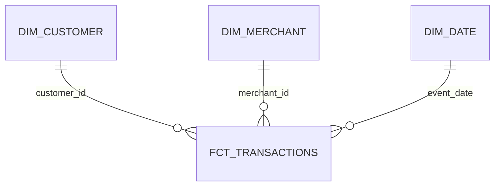

# Dimensional Modeling

The dbt `core` layer uses standard `fct_` naming for the transaction fact and `dim_` naming for dimensions.

`fct_transactions` has one row per `transaction_id`, with transaction-level amount and fraud measures plus customer, merchant, and date identifiers. `dim_customer` and `dim_merchant` provide observed current-state activity ranges and descriptive counts. `dim_date` supplies calendar attributes for observed dates.

Natural keys are used because source IDs are stable, present, and already unique at their grains. Adding hashed surrogate keys would add complexity without resolving a current integration problem. If multiple source systems introduced colliding IDs, deterministic hashes over source system plus natural key would be reasonable.

Dimensions are Type 1/current-state aggregates. SCD Type 2 is not required because the source contains no effective-dated customer or merchant attribute history. Implementing it would fabricate history semantics. Relationship tests establish actual customer, merchant, and date references.
