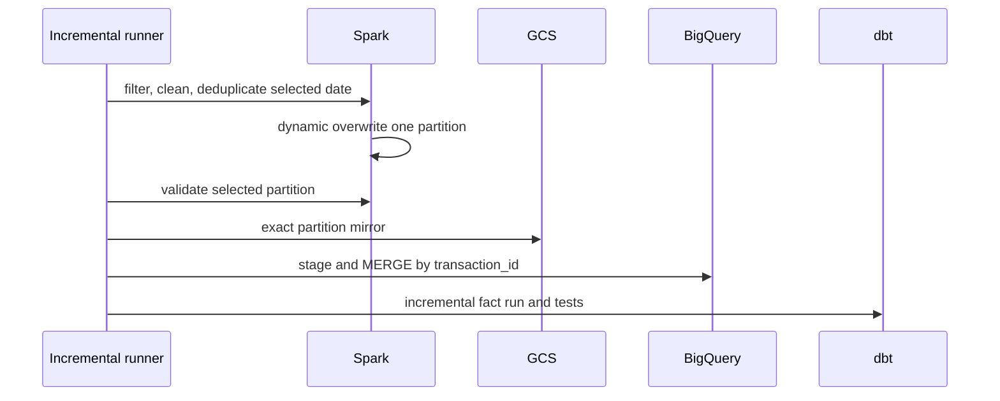

# Incremental Processing

The full pipeline remains available. `pipeline/run_incremental_pipeline.py --event-date YYYY-MM-DD` is a separate six-stage path:

Invalid ISO dates fail argument parsing. A date with no raw records raises before writing. `spark.sql.sources.partitionOverwriteMode=dynamic` and the writer option ensure unrelated local partitions remain. The cloud script verifies unrelated Parquet inventories before and after.

The fact model uses BigQuery dbt `merge`, `transaction_id` as unique key, daily partitioning, and a `processed_at` watermark. Full refresh remains available through `dbt run --full-refresh`.

Small dimensions and marts remain tables/views because rebuilding 31/100/500-row structures is clearer than introducing unnecessary incremental state.
