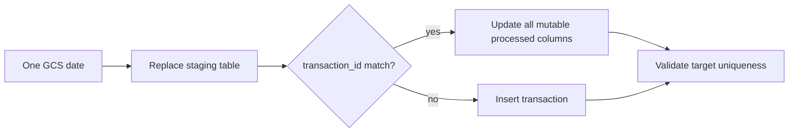

# BigQuery MERGE and Late Data

`warehouse/merge_processed_partition.py` loads one GCS partition into a replaceable staging table, validates nonempty/unique IDs and exact date membership, then runs:

Matched records are updated because a late correction can change amount or descriptive fields. Unmatched IDs are inserted. The target remains partitioned by `event_date`; updating a corrected date can move a row between partitions if justified by source data.

The isolated demo uses a separate GCS prefix and BigQuery target. Verified evidence in `benchmarks/results/incremental_merge_evidence.csv` shows:

- baseline: 2,640 rows;
- first and unchanged rerun: 2,640 rows;
- late/corrected merge: 2,641 rows;
- one late insert, one corrected update, zero duplicates.

The fixture selects an ID known to exist in the canonical target partition, pins its corrected timestamp safely inside the selected UTC date, and never edits canonical raw CSV files.
