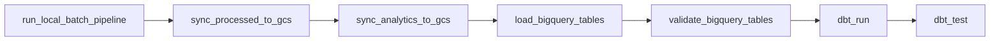

# Airflow Orchestration

Version 1.2 leaves `risk_pipeline_dag` unchanged and adds `risk_observability_dag` on an hourly, non-catchup schedule. Its three collectors run in parallel, followed by `evaluate_alert_rules` and `emit_alerts`; every task retries once after 30 seconds. The BigQuery collector requires the same local ADC/CLI setup as warehouse validation. This is static/local orchestration code, not a claim of an operating production scheduler.

The daily DAG is a linear full-batch graph:

Each BashOperator calls an existing repository script; transformation logic is not copied into the DAG. The repository root is the explicit working directory. Retries are configured once with a 30-second `timedelta`. `catchup=False` avoids backfilling every historical schedule automatically.

A task failure stops downstream tasks. Retrying a task relies on the underlying idempotency: full writes replace, GCS mirrors, BigQuery loads replace, MERGE upserts, and dbt tables rebuild/merge.

The incremental runner is currently an explicit CLI path rather than a second scheduled DAG. Production could add a parameterized DAG after defining arrival sensing, operational ownership, and backfill policy. Runtime DagBag verification remains environment-dependent because Airflow is not installed in the project virtual environments.
