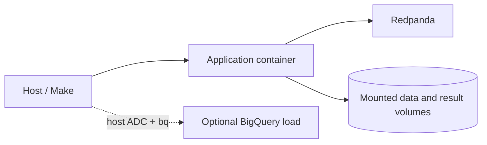

# Docker and Local Development

Version 1.2 adds a small Docker Compose environment for a reproducible streaming demonstration. It contains one Redpanda broker, an idempotent topic initializer, and the Python/Spark/dbt application image. Airflow is intentionally not containerized because its scheduler, metadata database, and webserver would make this portfolio demo materially heavier.

Start from `.env.example`; do not put credentials in `.env` or the build context. Run `make setup` for the host virtual environment, `make stream-up` for Redpanda, and the `stream-*` targets for the bounded demo. `make docker-down` stops services and preserves the named broker volume. The application image does not contain Google Cloud CLI tools; optional cloud loading runs on an authenticated host.

Docker/Compose availability and exact verification results belong in the final execution report, not as a permanent production claim.
