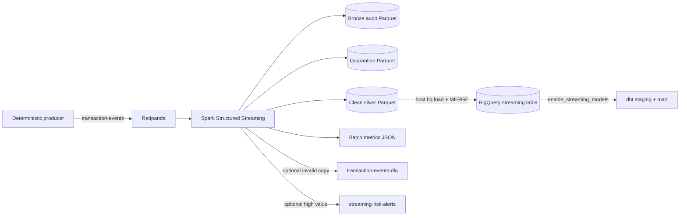

# Controlled Streaming Pipeline

This is a bounded simulation layer, separate from the canonical 100,350-row batch dataset.

The producer accepts event count, rate, seed, invalid, duplicate, and late-event intervals. `--dry-run-output` creates JSONL without Kafka. The consumer uses an explicit schema, UTC timestamps, `foreachBatch`, a durable checkpoint, a bounded `availableNow` trigger or maximum runtime, batch/run IDs, and exact reconciliation of clean + invalid + duplicate counts to input.

Invalid rows go to quarantine. Valid duplicate IDs are removed inside each Spark micro-batch. The optional host-side BigQuery loader deduplicates the entire staged input and uses `MERGE` on `transaction_id`, so same inputs update/insert rather than append duplicates. Local silver files are audit artifacts and do not claim global uniqueness across independently reset checkpoints.

Generated paths are `data/streaming/{bronze,silver,quarantine,metrics,checkpoints}/transaction_events`. The BigQuery table and four dbt streaming models are optional: `dbt ... --vars '{enable_streaming_models: true}'`. Version 1.4 defaults preserve the verified graph at 15 models/37 tests; local streaming parses 19 models/57 tests, while the separate GCP source mode parses 19 models/58 tests.

Limitations: one broker, one topic partition, local Spark, no throughput/SLA claim, and no executed live BigQuery streaming claim unless separately evidenced.
