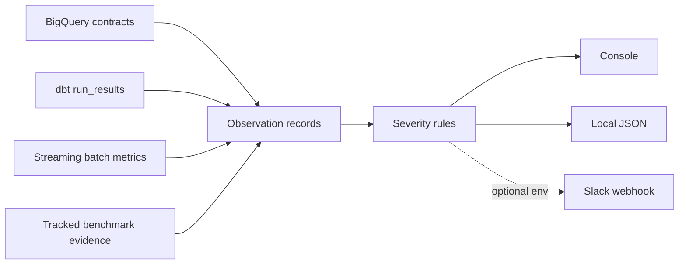

# Data Observability and Alerting

Observations contain timestamp, pipeline/run identifiers, table and metric names, value and expected bounds, `PASS`/`WARN`/`FAIL`, `INFO`/`WARNING`/`CRITICAL`, and details. Checks cover warehouse row counts, uniqueness/nulls/date counts, local scale and incremental evidence, dbt node outcomes, streaming availability, clean counts, invalid rate, and micro-batch reconciliation. Freshness and generic range helpers are unit tested and reusable.

`make observe` is local-first. It does not silently call GCP; `--component bigquery` is explicit. Missing generated dbt/streaming artifacts produce warnings, never false passes. `make alert-demo` emits an intentionally labeled failure to console and ignored JSON. Slack is used only when `SLACK_WEBHOOK_URL` exists; absence is safe.

These are portfolio-mode checks and channels, not a production monitoring SLA, pager integration, or incident-management system.

Version 1.3 exports the generated streaming metrics in Prometheus format, scrapes Redpanda `/public_metrics`, evaluates nine alert rules, and provisions three Grafana dashboards. Alertmanager sends firing/resolved payloads to the local project webhook, retaining console/file/optional-Slack behavior. See [the v1.3 monitoring guide](28-v1-3-streaming-runtime-and-monitoring.md).
