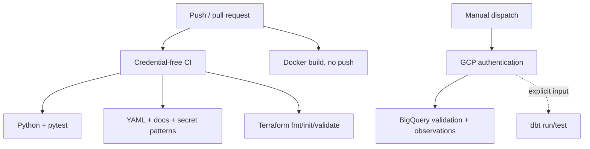

# CI/CD

`.github/workflows/ci.yml` needs no cloud credentials. It validates Python, YAML, local Markdown links, selected secret patterns, tests, Terraform formatting/configuration, and whitespace. `docker-build.yml` builds without publishing. `optional-cloud-integration.yml` is manual, uses repository secrets, validates the live warehouse, and runs dbt only when selected.

The manual workflow expects `GCP_PROJECT_ID`, `BIGQUERY_DATASET`, and `GCP_SERVICE_ACCOUNT_JSON`; no value is committed. Workflow files demonstrate CI/CD design but must not be described as enterprise deployment automation or as passing until GitHub has actually run them.
