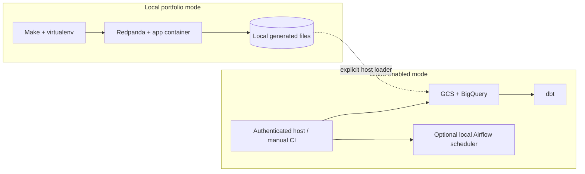

# Deployment Guide

Local mode requires Python 3.11, Java 17 for Spark, Docker Compose for Redpanda, and `make setup`. Copy `.env.example` only for non-secret configuration. Run `make stream-up`, producer, consumer, validator, observations, and alerts in order.

Cloud-enabled mode assumes existing Terraform-provisioned v1.1 resources, ADC or manual-workflow credentials, `bq`, and appropriate least-privilege access. Run the optional streaming loader only after local silver validation; then enable the two streaming dbt models explicitly. Terraform remains a separate plan/review/apply lifecycle—this upgrade does not automatically apply infrastructure.

Airflow can load both DAGs when `AIRFLOW_HOME` and dependencies are configured locally. `AIRFLOW_PROJECT_PYTHON` can point monitoring tasks at the v1.2 environment (the default is `.venv-v12/bin/python`). It is orchestration demonstration code, not a managed Composer deployment.
