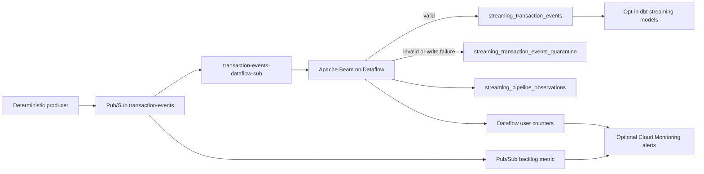

# GCP Streaming Deployment Mode (v1.4)

## Status and scope

Version 1.4 adds a controlled GCP-native path alongside the existing local Redpanda/Spark path. The code, schemas, Terraform definitions, tests, and runbooks are implemented. No live Pub/Sub, Dataflow, BigQuery, Monitoring, or budget resources are created by default, and a successful live GCP deployment must not be claimed until the manual demo is actually run and cleaned up.



This is a short portfolio demo, not a production streaming deployment. Pub/Sub is unbounded, so the Dataflow job does not finish by itself. The launcher cancels the matching demo job after at most 15 minutes and also installs an exit trap.

## Required APIs and tools

The opt-in Terraform definition enables these APIs when `enable_gcp_streaming=true`:

- BigQuery API
- Compute Engine API
- Dataflow API
- Cloud Monitoring API
- Pub/Sub API

Local tools are Python 3.11, Terraform 1.5 or newer, `gcloud`, `bq`, and dbt-bigquery. Install the GCP streaming dependencies only for this mode:

```bash
.venv-v12/bin/python -m pip install -r requirements-gcp-streaming.txt
```

Authentication comes from Application Default Credentials or the manual workflow secret. No credential JSON, key path, billing account ID, or private key is committed.

The live launcher identity must be allowed to create Dataflow jobs, publish to `transaction-events`, and act as the worker service account (typically narrow `roles/dataflow.developer`, topic-level `roles/pubsub.publisher`, and service-account-level `roles/iam.serviceAccountUser`). Terraform grants the worker only its runtime roles: Dataflow worker, Pub/Sub subscriber/viewer, dataset editor, temp-bucket object administrator, and Monitoring metric writer. Grant launcher permissions to a reviewed human or workload-identity principal; do not hardcode that principal in this repository.

## Environment

Copy `.env.example` values into an untracked `.env` or export them in the shell. Review every value:

```bash
export GCP_PROJECT_ID="your-project-id"
export GCP_STREAMING_REGION="us-central1"
export DBT_DATASET="risk_analytics"
export GCP_STREAMING_DEMO_EVENT_COUNT="1000"
export GCP_STREAMING_MAX_DEMO_MINUTES="15"
export GCP_STREAMING_NUM_WORKERS="1"
export GCP_STREAMING_MAX_WORKERS="1"
export GCP_STREAMING_MACHINE_TYPE="n1-standard-1"
export GCP_STREAMING_SERVICE_ACCOUNT="risk-streaming-dataflow@${GCP_PROJECT_ID}.iam.gserviceaccount.com"
```

Do not set `ACKNOWLEDGE_GCP_COST_RISK=true` until immediately before an approved live action.

## Terraform plan

All v1.4 resource flags default to false. Formatting and validation are safe local checks:

```bash
terraform -chdir=infrastructure/terraform fmt -check -recursive
terraform -chdir=infrastructure/terraform init -backend=false -input=false
terraform -chdir=infrastructure/terraform validate
```

The plan command checks identity, active project, billing-enabled state, event count, duration, and worker limits first:

```bash
export ACKNOWLEDGE_GCP_COST_RISK=true
make gcp-streaming-plan
```

`make gcp-streaming-plan` passes `enable_gcp_streaming=true` but never runs `terraform apply`. Review the plan for exactly two topics, one subscription, three tables, one dedicated one-day-lifecycle temp bucket, one worker service account, narrow IAM grants, and optional resources. Applying the plan requires separate, explicit user approval and is outside the default workflow.

Optional monitoring is enabled only with `-var=enable_monitoring_alerts=true`. Optional budget Terraform also requires `-var=enable_budget_alerts=true` and a separately supplied `billing_account_id`; no billing account is hardcoded.

## Pub/Sub and producer

Terraform defines:

- `transaction-events`, retained for one day;
- `transaction-events-dataflow-sub`, with one-day retention and five dead-letter attempts;
- `transaction-events-dlq`, retained for one day.

The producer supports deterministic count, rate, seed, invalid, duplicate, and late-event intervals. Dry run requires no GCP credentials:

```bash
make gcp-streaming-producer-dry-run
```

Live mode prints a cost warning and refuses to publish without acknowledgement. More than 10,000 events is refused unless `--allow-large-demo` is supplied; the documented demo remains 1,000 events.

## Beam/Dataflow behavior

Terraform also creates a dedicated `${GCP_PROJECT_ID}-streaming-dataflow-temp` bucket only in the opt-in mode. Dataflow gets object-administrator access to that bucket—not the canonical processed bucket—and a one-day lifecycle removes abandoned staging objects.

`gcp_streaming/beam_pipeline/streaming_to_bigquery.py`:

1. reads bytes from the exact Pub/Sub subscription;
2. parses JSON and validates the explicit source contract;
3. rejects malformed JSON, missing/unexpected fields, invalid amounts/types, invalid timestamps, and event timestamps after ingestion;
4. attaches `processing_timestamp`, `run_id`, `source_system`, and `validation_status` to valid rows;
5. sends validation failures to quarantine;
6. configures BigQuery streaming inserts with retries disabled for permanent row errors, captures extended insert errors, and quarantines failed rows;
7. writes per-record observations; and
8. emits Dataflow user counters for valid, invalid, and BigQuery write-failure records.

Runner options include project, region, temp/staging locations, job name, worker service account, machine type, worker count, maximum workers, and `save_main_session`. The guard rejects an initial worker count other than one and a maximum above two. Autoscaling is disabled for the demo.

Because the source is unbounded, there is no honest bounded Pub/Sub/Dataflow mode. `run_short_demo.sh` launches it, publishes the small sample, waits only for the configured safety window, and cancels it. The stop trap is defense in depth, not a billing guarantee.

## BigQuery tables

The existing `risk_analytics` dataset is reused; canonical batch tables are unchanged.

| Table | Partition | Clustering | Purpose |
|---|---|---|---|
| `streaming_transaction_events` | `event_date` | customer, merchant, type, validation | Valid typed events |
| `streaming_transaction_events_quarantine` | `processing_timestamp` | error field, run | Raw payload and validation/write failure |
| `streaming_pipeline_observations` | `observation_timestamp` | metric, status, severity, run | Pipeline observations |

All three tables expire partitions after seven days by default (configurable only from 1–30 days). The table definitions remain until intentionally removed, but old demo partitions do not persist indefinitely.

## dbt mode and counts

The four opt-in models are `stg_streaming_transaction_events`, `mart_streaming_risk_summary`, `mart_streaming_event_quality`, and `mart_realtime_risk_trends`. Tests cover ID uniqueness/non-nullness, accepted event types, amount bounds, dates, impossible timestamps, quarantine error reasons, and mart reconciliation.

Locally parsed counts:

- default: 15 models / 37 tests;
- local streaming: 19 models / 57 tests;
- GCP streaming: 19 models / 58 tests.

Parse without querying BigQuery:

```bash
make gcp-streaming-dbt-parse
```

Run/test commands query BigQuery and therefore print cost warnings:

```bash
make gcp-streaming-dbt-run
make gcp-streaming-dbt-test
```

## Cloud Monitoring

Optional Terraform policies cover Pub/Sub backlog, Dataflow job failure, absence of the valid-record counter, invalid-record ratio, BigQuery insert failures, and a Dataflow runtime overrun. The pipeline's Beam counters are exported by Dataflow as user counters. Notification channels are accepted only as variable input; none are hardcoded. Configure email, SMS, PagerDuty, or other channels in the target project, then pass their resource names in `streaming_notification_channel_ids`.

Monitoring metrics and policies can incur charges. Keep `enable_monitoring_alerts=false` unless the policies are required for the demo.

## Demo flow

Only after an approved plan and approved infrastructure creation:

```bash
export ACKNOWLEDGE_GCP_COST_RISK=true
make gcp-streaming-preflight
make gcp-streaming-demo
make gcp-streaming-check-active
```

The manual GitHub workflow follows the same rules. It is `workflow_dispatch` only, performs credential-free checks first, requires secrets only for live mode, plans without applying, uses 1,000 events/one worker by default, always requests job cancellation, and lists remaining resources.

Continue with the [cost controls and cleanup guide](29-gcp-cost-controls-and-cleanup.md) before any live run.
