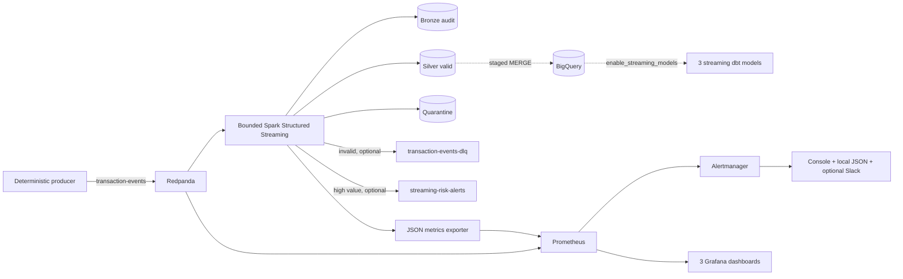

# Version 1.3 Streaming Runtime and Monitoring

Version 1.3 turns the controlled v1.2 scaffolding into a complete local deployment definition while keeping the verified v1.1 batch platform unchanged.



## Exact bounded demo

```bash
make docker-up
make stream-produce
make stream-process
make stream-validate
make stream-restart-snapshot
make stream-process
make stream-restart-verify
make observe
make alert-demo
make docker-down
```

`stream-produce` emits 30 deterministic events at 10 events/second using seed `202613`, with controlled invalid, duplicate, and late cases. Change the CLI arguments for another bounded data set.

Internal Kafka bootstrap server: `redpanda:29092`. Host bootstrap server: `localhost:19092`.

## Topics

| Topic | Purpose | Local shape |
|---|---|---|
| `transaction-events` | Producer input and Spark source | 1 partition, 1 replica |
| `transaction-events-dlq` | Optional copy of invalid raw JSON | 1 partition, 1 replica |
| `streaming-risk-alerts` | Optional high-value clean-event notifications | 1 partition, 1 replica |

Topic initialization first describes each topic and only creates a missing topic. It then describes the created topic, so broker/configuration failures are not silently ignored. Redpanda consumer-group lag metrics are enabled for Prometheus. Spark checkpoints remain under the selected data root. Reusing the same checkpoint causes the second `availableNow` run to process only unseen offsets; the snapshot/verify commands confirm that completed batch metrics did not change.

Spark's Kafka sinks are at-least-once across a failure between topic publication and checkpoint commitment. Quarantine Parquet remains the authoritative local invalid-record audit even when DLQ publication is disabled.

## Monitoring

- Redpanda Console: <http://localhost:8080>
- Prometheus: <http://localhost:9090>
- Alertmanager: <http://localhost:9093>
- Grafana: <http://localhost:3000>
- Exported application metrics: <http://localhost:9108/metrics>

Grafana provisions dashboards for Kafka health/lag, Spark batch health/freshness/accounting, and data quality/DLQ/risk events. See [monitoring documentation](../monitoring/README.md).

Redpanda exposes native Prometheus metrics, so this deployment does not add a JVM/JMX exporter. Consumer-lag series exist only while Redpanda has applicable consumer-group state; Spark checkpoints remain the source of truth for replay prevention.

## Alert rules

Rules cover broker availability, consumer lag, missing/recent batches, invalid rate, DLQ events, optional BigQuery failure, streaming dbt failure, and freshness. Alertmanager always routes to the local webhook; Slack remains optional and its absence is safe.

## dbt and BigQuery

The optional loader writes a machine-readable success/failure status, replaces and loads the staging snapshot, deduplicates it, and `MERGE`s by transaction ID. Streaming dbt remains opt-in. Default execution stays at 15 models/37 tests; `enable_streaming_models: true` parses 18 models/50 tests, including `mart_streaming_event_quality` and reconciliation tests.

## Claim boundary

Repository implementation, unit/static validation, and any later recorded Docker integration run are separate facts. Do not claim the Compose stack, Kafka traffic, Spark consumer, dashboards, or Alertmanager runtime passed on a host until the commands actually complete there. This is local portfolio infrastructure, not production deployment.

## Current verification record

During the v1.3 implementation on 2026-07-16, 33 Python tests, repository syntax/link/secret checks, both dbt parses, the unchanged 15-model default dbt run and 37 tests, canonical BigQuery validation, Terraform validation, and direct HTTP smoke tests for the project metrics exporter and alert webhook passed. The optional streaming source table did not exist, so streaming-enabled dbt run/test was not attempted.

No Docker-compatible runtime was installed on that host. Docker build, Compose semantic validation, Redpanda/topic runtime, Kafka producer delivery, Spark Kafka consumption, real checkpoint replay, Prometheus/Grafana/Alertmanager containers, and the manual GitHub workflow remain unverified until executed on a Docker-capable host.
